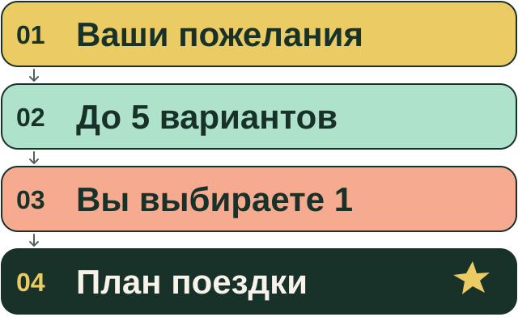

# ЕНОТ · отдых начинается с вас

**Личное ателье продуманного отдыха.** Расскажите, каким хочется вернуться: выспавшимся, полным впечатлений, ближе друг к другу. ЕНОТ соберёт варианты, объяснит компромиссы и поможет превратить ваш выбор в удобный план.

[Начать поездку ↓](#начать-поездку) · [Что получите ↓](#что-получите)



**Пожелания → до 5 вариантов за цикл → вы явно выбираете 1 → практический план.**

## Начать поездку

1. Откройте новый облачный чат с сильной моделью и доступным поиском в интернете.
2. Откройте [ENOT_CHAT_START.md](ENOT_CHAT_START.md), скачайте файл через **Download raw file** и прикрепите к чату. Можно вместо этого скопировать всё его содержимое в сообщение.
3. Скопируйте анкету ниже, замените подсказки в скобках своими ответами и отправьте в тот же чат.

**Любой пункт можно пропустить.** «Пока не знаю» тоже подойдёт. Можно просто рассказать о поездке своими словами. Git, терминал и специальные плагины для старта не нужны.

### Ваша анкета — можно копировать целиком

Это семь блоков из [стартового протокола](ENOT_CHAT_START.md#3-собери-запрос-один-раз).

```text
Спланируем отдых по ЕНОТу.

Когда и откуда: [город,
даты/окно, сколько дней; сдвиг
и возврат — если важно]
Деньги: [сумма/потолок, валюта,
на всех/человека; что включить]
Компания: [взрослые,
дети/возраст, комнаты/кровати;
ограничения — если важно]
Отдых: [каким хочу вернуться,
интересы и темп]
География: [куда / «предложи»;
визы/оплата без реквизитов
— если влияют]
Хлопоты: [пакет/самостоятельно,
багаж, авто, пересадки/ночёвки
— что допустимо]
Обязательное: [нужно/нельзя;
допущения и что пока не знаю]
```

Если осталось важное неизвестное, ЕНОТ предложит один короткий раунд уточнений. Можно ответить или написать **«ищи так»**: поиск продолжится, пробелы останутся видимыми. Пустые поля не получают выдуманных ответов.

## Что получите

**Сначала — до пяти способов отдохнуть.** У каждого — идея, весь бюджет, дорога и хлопоты, главный плюс и честный компромисс. Рядом видно, что подтверждено, что оценено и что неизвестно. Подборка проходит первую проверку.

**Затем — ваш выбор.** Напишите, например: «Выбираю вариант 3. Собери план». Или попросите изменить подборку. Подробный план начинается после явного выбора одного варианта.

**В финале — поездка под рукой.** После второй проверки получите суть, практику от выезда до возвращения и подробности с расчётами и источниками. При доступной работе с файлами — офлайн-комплект: `Путеводитель.html`, `Поездка.md`, `Продолжение.md` и собранный ZIP. Внешним картам и перепроверке цен нужна сеть. Если файлы создать нельзя, результат и снимок для продолжения будут текстом в чате.

**«Готово» означает, что комплект выдан.** Бронирование и оплата остаются за вами; ближайшие действия и существенные неизвестности видны в плане. Перед покупкой цены и условия нужно перепроверить.

**Чтобы продолжить позже**, прикрепите к новому чату стартовый протокол и последний `Продолжение.md`, затем задайте конкретный вопрос: «Перепроверь дорогу перед покупкой» или «Сделай второй день спокойнее». Старые цены требуют новой проверки.

<details>
<summary><strong>Как устроен ЕНОТ · для любопытных и разработчиков</strong></summary>

Основной способ работы — облачный чат владельца. Веб и доступные инструменты помогают проверять факты. Блог даёт идею; правило подтверждает официальный источник, а условия предложения — перевозчик или продавец. Недоступное остаётся неизвестным.

- [Текущее состояние и границы проверки](STATE.md)
- [Инструкции для изменения репозитория](AGENTS.md)
- [Маршруты источников](config/sources.yaml) и [границы исходного исследования](docs/SOURCES.md)
- [Разговорный и визуальный стиль](docs/UX_BRANDBOOK.md)

</details>
